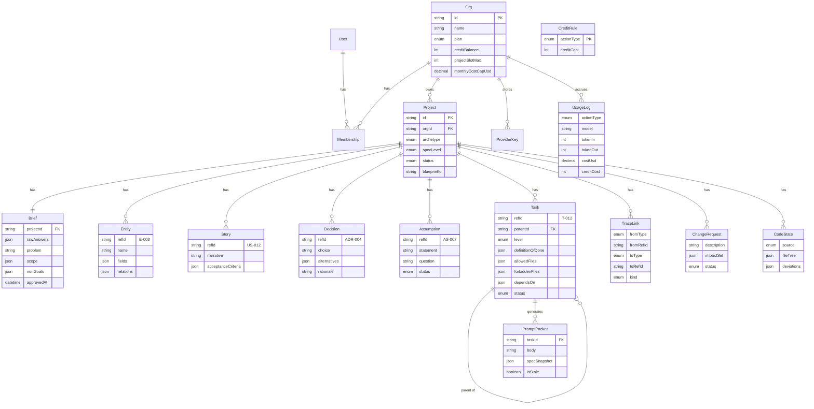

# 02 — Data & alur

## ERD



Definisi kolom lengkap ada di `prisma/schema.prisma`. Tiga hal yang tidak boleh
diubah:

- `orgId` ada di semua tabel milik user, walau semua org fase 1 berisi satu orang
- `TraceLink` adalah satu-satunya tempat keterkaitan antar artefak hidup
- `Task.parentId` menyimpan hierarki MILESTONE → TASK → STEP

## Penomoran refId

Dihitung per proyek, tidak pernah dipakai ulang walau artefaknya dihapus.
Simpan counter di kolom `Project.refCounters` (json, `{E: 12, US: 31, T: 58}`).

| Prefix | Untuk |
|---|---|
| `E-` | Entity |
| `US-` | Story |
| `AC-` | Acceptance criteria, bernomor dalam story: `US-012/AC-2` |
| `ADR-` | Decision |
| `AS-` | Assumption |
| `M-` `T-` `S-` | Task per level. Step mewarisi nomor induk: `S-012-1` |

## State machine

**Project**
```
INTERVIEWING --brief approved--> COMPILING --pipeline ok--> ACTIVE
COMPILING --gagal--> INTERVIEWING (credit dikembalikan)
ACTIVE --user--> ARCHIVED (slot dibebaskan)
```

**Task**
```
TODO --user--> IN_PROGRESS --user--> DONE
DONE --change request--> INVALIDATED --user--> TODO
```
Task hanya bisa masuk IN_PROGRESS kalau semua `dependsOn` berstatus DONE.
Task induk otomatis DONE saat semua anaknya DONE.

**Assumption**
```
OPEN --user menjawab--> CONFIRMED
OPEN --user menolak--> REJECTED --> memicu ChangeRequest otomatis
```

**ChangeRequest**
```
ANALYZING --analisis selesai--> AWAITING_APPROVAL
AWAITING_APPROVAL --setuju--> APPLIED
AWAITING_APPROVAL --batal--> DISCARDED
```

---

## Alur end-to-end

### A. Buat proyek

1. User memilih arketipe. Sistem memuat pohon pertanyaan dari
   `lib/interview/trees/<archetype>.ts`.
2. Satu pertanyaan per layar. Tiap jawaban mengisi slot dan bisa membuka atau
   menutup cabang berikutnya.
3. Sistem berhenti saat semua slot wajib terisi atau batas pertanyaan tercapai.
4. Job `compile.brief` berjalan: jawaban mentah diringkas jadi problem, target
   user, scope, non-goals. Hal yang tidak dijawab user tapi tetap diisi sistem
   ditandai sebagai asumsi.
5. Brief ditampilkan. User boleh mengedit tiap field. Approve mengunci brief.

Credit terpotong di langkah 4, bukan di langkah 1. Kalau user berhenti di tengah
wawancara, tidak ada biaya.

### B. Compile spec

Job `compile.spec` berjalan berurutan, tiap tahap punya gerbang validasi:

```
brief
  -> domain      (entitas + field + relasi)
  -> stories     (story + acceptance criteria, tertaut ke entitas)
  -> decisions   (ADR stack, memakai blueprint catalog)
  -> critic      (cari kontradiksi, AC tak terukur, scope tak berbatas)
  -> tasks       (milestone + task, dependensi, DoD, allowedFiles)
  -> tracelinks  (deterministik, dari refId yang disebut tiap tahap)
```

Detail tiap tahap ada di `03-ai-pipeline.md`.

Progres disiarkan ke UI lewat Inngest step event. Kalau satu tahap gagal setelah
2 retry, proyek kembali ke INTERVIEWING dan credit dikembalikan.

### C. Ambil prompt

1. User membuka task. Sistem mengecek asumsi OPEN yang tertaut lewat `TraceLink`
   berjenis ASSUMES.
2. Kalau ada, pertanyaan asumsi muncul lebih dulu. Prompt terkunci sampai
   dijawab.
3. Sistem mengumpulkan konteks: task itu sendiri, story yang tertaut, entitas
   yang disebut story itu, ADR berjenis CONSTRAINS, non-goals proyek, dan
   `CodeState` terakhir.
4. Paket disusun. 80% template, LLM hanya menulis bagian intent dan catatan
   khusus.
5. Hasil disimpan sebagai `PromptPacket` dengan `specSnapshot` berisi daftar
   refId yang dipakai. Ini yang nanti dipakai untuk menandai packet basi.

Tidak memotong credit. Ini pendorong retensi, jangan pernah dibebani.

### D. Paste-back

1. User menempel file tree, isi file, atau pesan error.
2. Sistem menyimpan `CodeState`, lalu membandingkan dengan `allowedFiles` semua
   task DONE dan dengan non-goals proyek.
3. Deviasi dikembalikan sebagai daftar: path, alasan, keparahan.
4. Tiap deviasi punya dua tombol: "masukkan ke scope" (membuat ChangeRequest)
   atau "abaikan".

### E. Change request

1. User menulis perubahan dalam bahasa bebas.
2. LLM memetakan perubahan itu ke refId yang terdampak langsung.
3. **Traversal graf berjalan tanpa LLM**: dari refId awal, telusuri `TraceLink`
   dua arah sampai tidak ada simpul baru. Hasilnya `impactSet`.
4. Task DONE yang ada di `impactSet` ditandai INVALIDATED.
5. User melihat angkanya sebelum menyetujui.
6. Setelah disetujui, hanya artefak di `impactSet` yang diregenerate.
   `PromptPacket` yang `specSnapshot`-nya beririsan dengan `impactSet` ditandai
   `isStale = true`.

Langkah 3 adalah alasan `TraceLink` ada. Biaya nol, hasilnya deterministik.

---

## Permukaan API

Route handler tipis. Semua logika di `lib/`, semua job AI dilempar ke Inngest.

| Method | Path | Kembalian |
|---|---|---|
| POST | `/api/projects` | buat proyek, mulai wawancara |
| GET | `/api/projects/:id/interview/next` | pertanyaan berikutnya |
| POST | `/api/projects/:id/interview/answer` | simpan jawaban, kembalikan pertanyaan berikut atau sinyal selesai |
| POST | `/api/projects/:id/brief/compile` | antre job brief |
| PATCH | `/api/projects/:id/brief` | edit field brief |
| POST | `/api/projects/:id/brief/approve` | kunci brief, antre job compile spec |
| GET | `/api/projects/:id/spec` | semua artefak + tracelink |
| POST | `/api/projects/:id/spec/:refId/refine` | refine satu bagian |
| PATCH | `/api/projects/:id/spec/:refId` | edit manual, tanpa LLM |
| GET | `/api/projects/:id/tasks` | task tree + status kunci dependensi |
| GET | `/api/tasks/:id/packet` | paket prompt, generate kalau belum ada atau basi |
| POST | `/api/tasks/:id/split` | pecah jadi step |
| PATCH | `/api/tasks/:id/status` | ubah status, propagasi ke induk |
| POST | `/api/projects/:id/code-state` | paste-back, kembalikan deviasi |
| POST | `/api/projects/:id/changes` | ajukan change request |
| POST | `/api/changes/:id/apply` | terapkan |
| GET | `/api/projects/:id/export` | ZIP |
| GET | `/api/usage` | sisa credit, riwayat |
| POST | `/api/keys` | simpan BYOK setelah validasi |

Semua endpoint memvalidasi kepemilikan lewat `orgId` dari sesi, bukan dari body.
